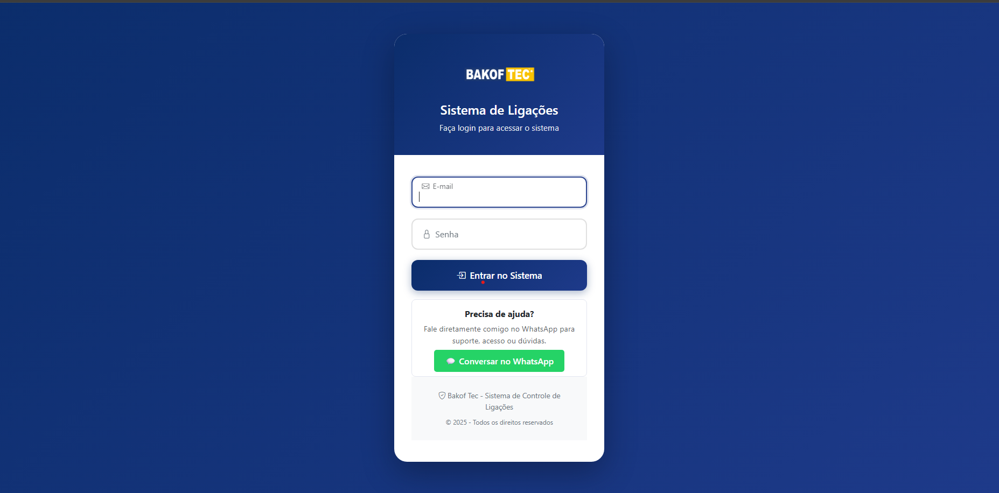
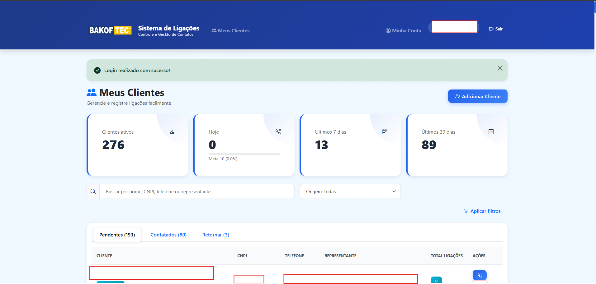
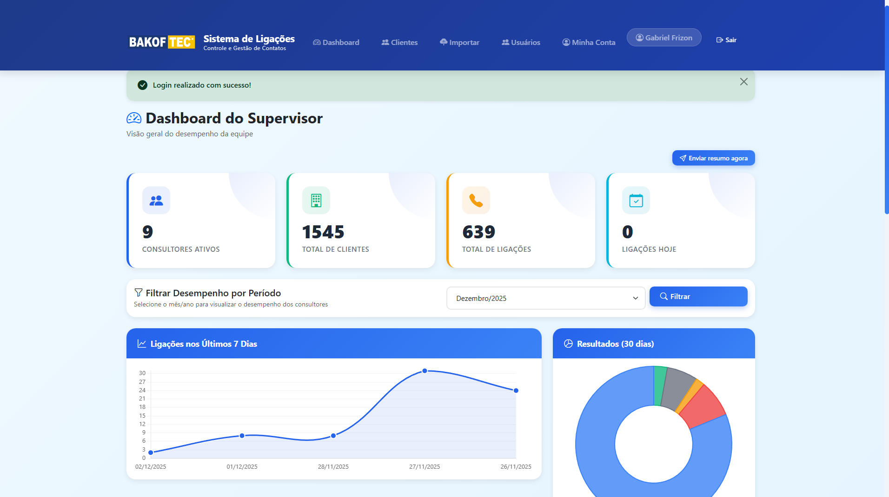
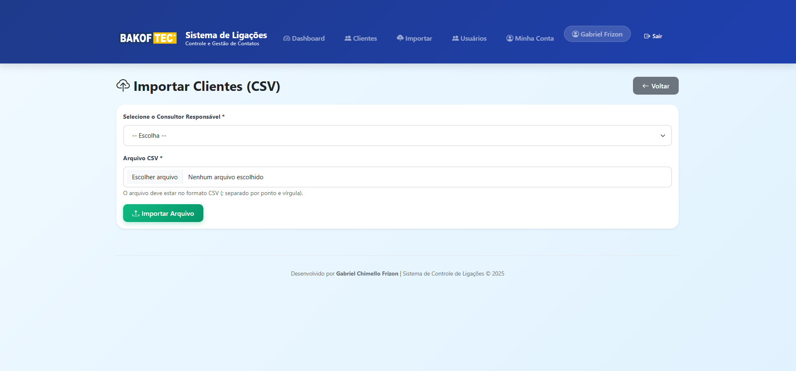
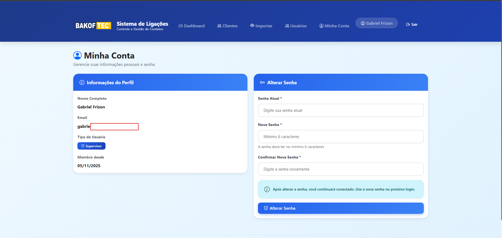
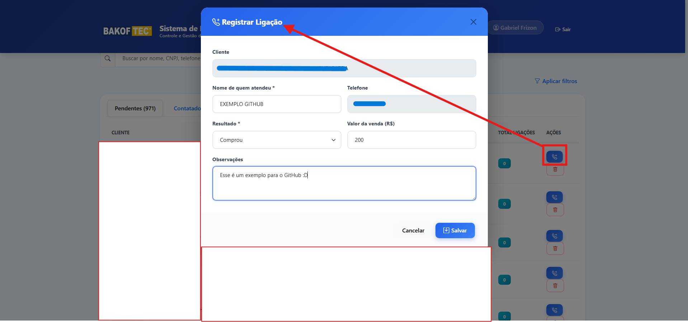
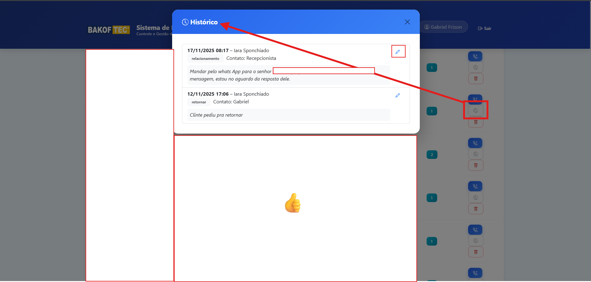
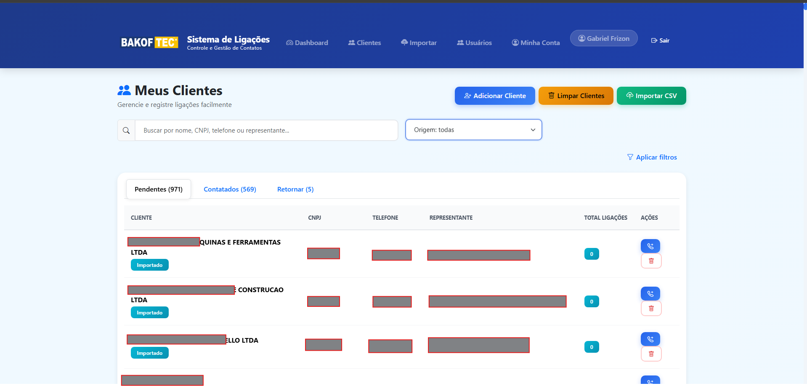
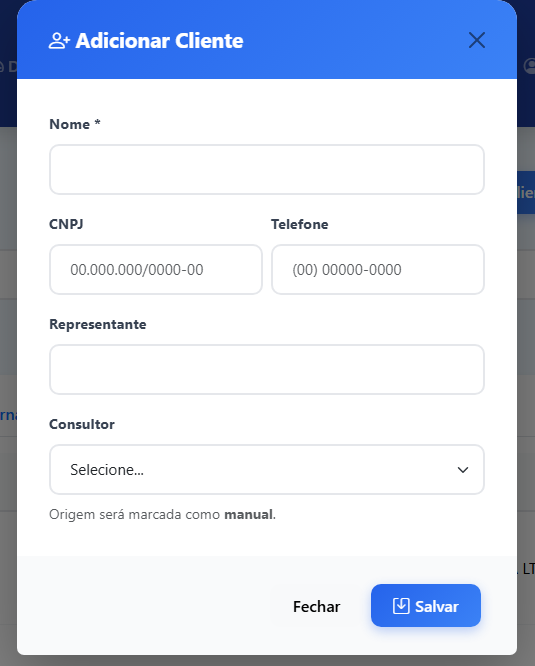

# 📞 Bakof Call Control

> Plataforma interna desenvolvida para controle comercial, registro de ligações e gestão de desempenho da equipe.  
> Atualmente implantado e rodando em produção no ambiente da Bakof.

---

<div align="center">


</div>

---

## 🚀 Funcionalidades

✔ Login com permissões (Consultor / Supervisor)  
✔ Dashboard com metas, conversão e ranking  
✔ CRUD de clientes e ligações  
✔ Importação de base via CSV  
✔ Gestão de usuários  
✔ Histórico detalhado de chamadas  
✔ Scheduler com envio automático de relatórios  
✔ Interface moderna e responsiva  

---

## 🏗️ Tecnologias Utilizadas

- Python + Flask  
- SQLAlchemy / MySQL  
- Bootstrap / Jinja2  
- APScheduler  
- Waitress  

---

## 📌 Estrutura do Projeto

```
bakof-call-control/
│
├── app.py
├── requirements.txt
├── README.md
├── .env.example
├── .gitignore
│
├── templates/
├── static/
├── scripts/
├── docs/
│   └── screenshots/
├── uploads/
├── logs/
├── BKP/
│
└── legacy/
```

---

## ⚙️ Como executar localmente

```bash
git clone https://github.com/SEU_USUARIO/bakof-call-control.git
cd bakof-call-control

python -m venv .venv
.venv\Scripts\activate

pip install -r requirements.txt

python app.py
```

Acesse:  
👉 http://localhost:5000

---

# 📸 Preview do Sistema

### 🔐 Login


### 📊 Dashboard — Consultor


### 📈 Dashboard — Supervisor


### 📁 Importação CSV


### 👤 Minha Conta


### 📞 Registrar Ligação


### 📜 Histórico de Contato


### 📋 Meus Clientes / Retorno


### ➕ Adicionar Cliente


---

## 🔐 Segurança Aplicada

✔ Auth com sessão  
✔ Hash de senhas  
✔ SQLAlchemy / ORM  
✔ Variáveis sensíveis via `.env`

---

## 📬 Relatórios Automáticos

Sistema envia e-mails automáticos com indicadores comerciais através de APScheduler.

---

## 📌 Roadmap de melhorias

🔹 Exportação Excel/CSV avançada  
🔹 API REST para integrações externas  
🔹 Painéis adicionais para supervisores  

---

## 👨‍💻 Autor

**Gabriel Frizon**  
Analista de TI | Python | Automação  

---

## 📌 Licença

Sistema corporativo — uso interno © Bakof
